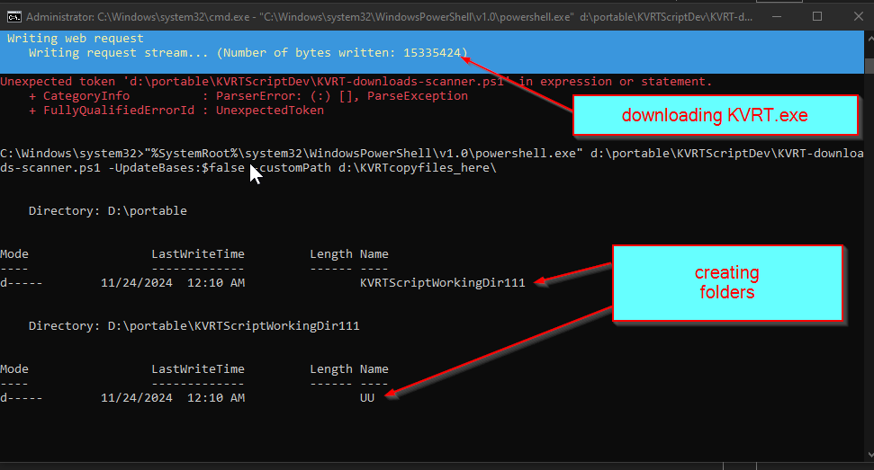
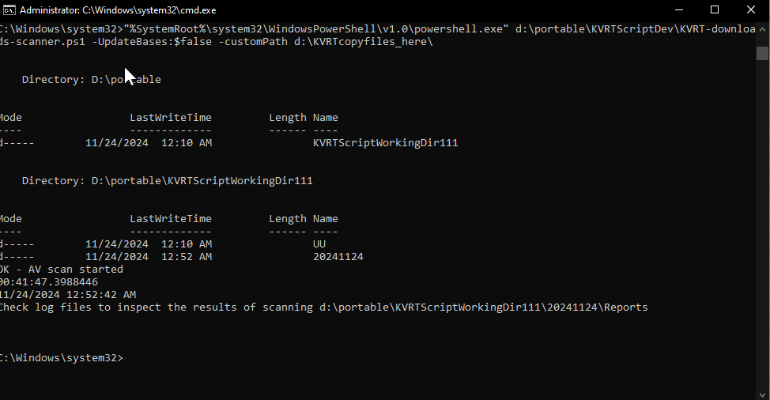
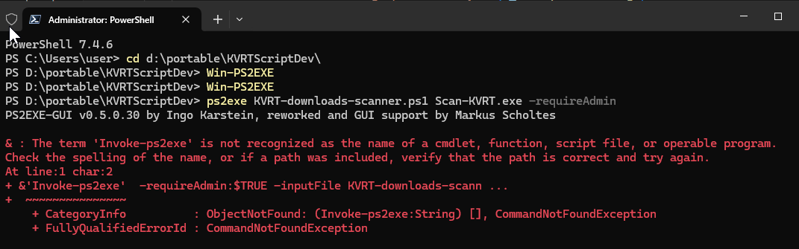
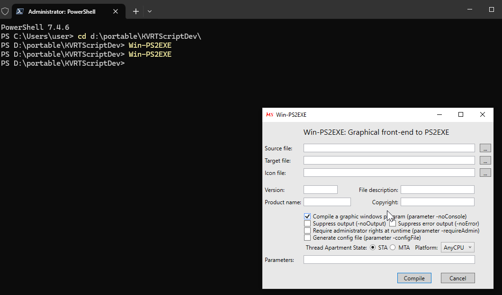

Title: KVRT downloads scanner

Date and Time: 2024-11-23 13:49
Simple Tags: #PS2EXE #KVRT #antivirus #virus
References:

https://webnote.satin-pl.com/2018/05/30/kvrt_silent/

https://support.kaspersky.com/help/kvrt/2024/ru-ru/269475.htm

https://support.kaspersky.ru/kvrt2024/269475

https://www.youtube.com/watch?v=o730kcgY2Bk

https://github.com/MScholtes/PS2EXE

https://gist.github.com/adamff-dev/8fbec036609a4a399558f3094c8690eb

Noted Tags: 
Problem: Need free and good working antivirus for Windows/Linux
Solution:
GPT:
Notes:


# Kaspersky Virus Removal Tool - Сканирование без взаимодействия с пользователем

#### Обновление и сканирование в тихом режиме

Скрипт `KVRT-downloads-scanner.ps1`:

```powershell

<#
 .SYNOPSIS
  Scan for viruses with Kaspersky Virus Removal Tool

 .DESCRIPTION


 .EXAMPLE
  KVRT-downloads-scanner.ps1

 .LINK

 .NOTES
  Version:        0.2
  Author:         Kuzniatsou Yuheni
  Purpose/Change: PowerShell Script to scan downloaded files. Supports integration with Download Managers like IDM

#>

#This will show you the current setting (e.g., Restricted, AllSigned, RemoteSigned, Unrestricted).
#Set-ExecutionPolicy Unrestricted


    param(
    [switch]$UpdateBases = $false,
    [string]$customPath = "%appdata%"
)

#Uncomment(Uncommon) to always download new tools(but make sure that the links $KVRTurl and $UUurl are correct)
#Remove-Item  -Recurse -Path "$KVRTPath" -Force -ErrorAction SilentlyContinue

$KVRTurl = "https://devbuilds.s.kaspersky-labs.com/devbuilds/KVRT/latest/full/KVRT.exe"
$UUurl = "http://products.s.kaspersky-labs.com/special/kasp_updater3.0/4.1.0.517/english-4.1.0.517/3839303233357c44454c7c31/kuu4.1.0.517_en.zip"

#EXAMPLES how to call from cmd.exe EXAMPLES
#"C:\Program Files\PowerShell\7\pwsh.exe" d:\portable\KVRTScriptDev\KVRT-downloads-scanner.ps1 -UpdateBases:$false -customPath "d:\Downloads\Compressed\Ex_Files_NLP_Python_ML_EssT.zip"
#"%SystemRoot%\system32\WindowsPowerShell\v1.0\powershell.exe" d:\portable\KVRTScriptDev\KVRT-downloads-scanner.ps1 -UpdateBases:$false -customPath d:\KVRTcopyfiles_here\
#"C:\Program Files\PowerShell\7\pwsh.exe" d:\portable\KVRTScriptDev\KVRT-downloads-scanner.ps1 -UpdateBases:$false -customPath "d:\Downloads\"


#"C:\Program Files\PowerShell\7\pwsh.exe" d:\portable\KVRTScriptDev\KVRT-downloads-scanner.ps1 -UpdateBases:$false -customPath "d:\Downloads\"

# Set the console encoding to UTF-8
$OutputEncoding = [System.Text.Encoding]::UTF8

$returnStateOK = 0
$returnStateWarning = 1
$returnStateCritical = 2
$returnStateUnknown = 3

#$ErrorActionPreference = "SilentlyContinue"

$errorstr = ""
$KVRTPath = "d:\portable\KVRTScriptWorkingDir111"

############################# updater.ini #############################

$updaterini = @"
[ConnectionSettings]
TimeoutConnection=60
UsePassiveFtpMode=true
UseProxyServer=false
AutomaticallyDetectProxyServerSettings=true
UseSpecifiedProxyServerSettings=false
AddressProxyServer=
PortProxyServer=8080
UseAuthenticationProxyServer=false
UserNameProxyServer=
PasswordProxyServer=
ByPassProxyServer=true
DownloadPatches=false

[AdditionalSettings]
CreateCrashDumpFile=true
TurnTrace=false
AddIconToTray=true
MinimizeProgramUponTermination=true
AnimateIcon=true
ReturnCodeDesc=All_files_are_up-to-date

[ReportSettings]
DisplayReportsOnScreen=false
SaveReportsToFile=true
AppendToPreviousFile=true
SizeLogFileValue=104852
ReportFileName=d:\\portable\\KVRTScriptWorkingDir\\UU\\Update-Report.log
DeleteIfSize=true
DeleteIfNumDay=false
NoChangeLogFile=false
NumDayLifeLOgFileValue=7

[DirectoriesSettings]
MoveToCurrentFolder=false
MoveToCustomFolder=true
UpdatesFolder=d:\\portable\\KVRTScriptWorkingDir\\UU\\Updates
TempFolder=d:\\portable\\KVRTScriptWorkingDir\\UU\\Temp
ClearTempFolder=false

[UpdatesSourceSettings]
SourceCustomPath=
SourceCustom=false
SourceKlabServer=true

[DownloadingSettings]
DownloadDataBasesAndModules=true

[ComponentSettings]
DownloadAllDatabases=false
DownloadSelectedComponents=true
ApplicationsOs=1
KasperskyFreeAntivirus_19_0=true


[ShedulerSettings]
LastUpdate=@Variant(\0\0\0\x10\0%\x82\x9d\x3\xcd\xda\x32\xff)
ShedulerType=0
PeriodValue=1
UseTime=true
Time=@Variant(\0\0\0\xf\0\0\0\0)
Monday=true
Tuesday=true
Wednesday=true
Thursday=true
Friday=true
Saturday=true
Sunday=true

[SdkSettings]
PrimaryIndexFileName=u0607g.xml
PrimaryIndexRelativeUrlPath=index
LicensePath=
SimpleModeLicensing=true
"@

############################# updater.ini #############################

#Script Timer
$watch = [System.Diagnostics.Stopwatch]::StartNew()
$watch.Start() #Start Timer


$exeFileName = "KVRT.exe"
$fullEXEfileName = Join-Path $KVRTPath $exeFileName

#If there is no folder, then create and fill it our tools KVRT.exe and Kaspersky Updater Utility
if (!(Test-Path -Path $fullEXEfileName -PathType Leaf)) {
  Try {
    Write-Verbose "Создаем директории"
    New-Item -ErrorAction Ignore -ItemType directory -Path $KVRTPath
    New-Item -ErrorAction Ignore -ItemType directory -Path "$KVRTPath\UU"

    Write-Verbose "Загружаем Kaspersky Virus Removal Tool из: $KVRTurl"
    Invoke-WebRequest -URI $KVRTurl -UseBasicParsing -OutFile "$KVRTPath\KVRT.exe"

  } catch [System.Exception] {
    $errorstr = $_.Exception.toString()
    Write-Host $errorstr
    [System.Environment]::Exit($returnStateCritical)
  }

}

$zipFileName = "kuu4.1.0.517_en.zip"
$fullZipPath = Join-Path $KVRTPath $zipFileName

#If there is no folder, then create and fill it our tools KVRT.exe and Kaspersky Updater Utility
if (!(Test-Path -Path $fullZipPath -PathType Leaf)) {
    Try {
      Write-Verbose "Создаем директории"
      New-Item -ErrorAction Ignore -ItemType directory -Path $KVRTPath
      New-Item -ErrorAction Ignore -ItemType directory -Path "$KVRTPath\UU"

      Write-Verbose "Загружаем Kaspersky Update Utility из: $UUurl"
      Invoke-WebRequest -URI $UUurl -UseBasicParsing -OutFile "$KVRTPath\kuu4.1.0.517_en.zip"
      Write-Verbose "Распаковываем архив c Kaspersky Update Utility в $KVRTPath\UU"
      Expand-Archive -Path "$KVRTPath\kuu4.1.0.517_en.zip"  -DestinationPath "$KVRTPath\UU" -Force
  
      Remove-Item -Path "$KVRTPath\kuu4.1.0.517_en.zip" -Force -ErrorAction SilentlyContinue
  
  
    } catch [System.Exception] {
      $errorstr = $_.Exception.toString()
      Write-Host $errorstr
      [System.Environment]::Exit($returnStateCritical)
    }
  
  }


if ($UpdateBases) {
    Write-Verbose "New config file Kaspersky Update Utility 3.0"
    $updaterini -replace '\n', "`r`n" | Out-File -FilePath "$KVRTPath\UU\updater.ini" -Force -Encoding ascii

    Write-Verbose "Updating virus bases..." 

    try {
        $process = Start-Process -FilePath "$KVRTPath\UU\UpdateUtility-Console.exe" -ArgumentList "-u -s -r -o ""$KVRTPath\UU\updater.ini""" -Wait -PassThru -RedirectStandardOutput "update_output.log" -RedirectStandardError "update_error.log"
    
        if ($process.ExitCode -eq 0) {
            Write-Verbose "UpdateUtility completed successfully."
        } else {
            Write-Warning "UpdateUtility returned error code $($process.ExitCode). Check update_output.log and update_error.log for details."
        }
    }
    catch {
        Write-Error "Error running UpdateUtility: $($_.Exception.Message)"
    }

}


$scannowDate = Get-Date -Format "yyyyMMdd"

if (!(Test-Path "$KVRTPath\$scannowDate")) {
    New-Item -ErrorAction Ignore -ItemType directory -Path "$KVRTPath\$scannowDate"
}


Write-Verbose "Starting scanning ..."
#$resultScan = & "$KVRTPath\KVRT.exe" -d "$KVRTPath\$scannowDate" -accepteula -silent -processlevel 0 -dontencrypt -moddirpath "$KVRTPath\UU\Updates" -custom "d:\portable\KVRTScriptWorkingDir\lab\" -details -noads -tracelevel DBG -trace -d "d:\portable\KVRTScriptWorkingDir\"
$resultScan = & "$KVRTPath\KVRT.exe" -custom "$customPath" -d "$KVRTPath\$scannowDate" -accepteula -silent -processlevel 0 -dontencrypt -moddirpath "$KVRTPath\UU\Updates" -details -noads -fixednames

#Good idea to run with -fixednames parameter so it would be more easily found in task manager as KVRT.exe

# try {
#   $resultScan = Start-Process -FilePath "$KVRTPath\KVRT.exe" -ArgumentList "-custom ""$customPath"" -d ""$KVRTPath\$scannowDate"" -accepteula -silent -fixednames -dontencrypt -processlevel 1" `
#                                 -RedirectStandardOutput "kvrt_output.log" `
#                                 -RedirectStandardError "kvrt_error.log" `
#                                 -Wait `
#                                 -PassThru

#   if ($resultScan.ExitCode -eq 0) {
#       Write-Host "KVRT scan completed successfully. See kvrt_output.log for details."
#   } else {
#       Write-Warning "KVRT scan returned error code $($resultScan.ExitCode). Check kvrt_error.log for details."
#   }
# }
# catch {
#   Write-Error "Error running KVRT: $($_.Exception.Message)"
# }


Write-Host "OK - AV scan started"

$watch.Stop() #Stop timer
Write-Host $watch.Elapsed #Execution time
Write-Host (Get-Date)

Write-Host "Check log files to inspect the results of scanning $KVRTPath\$scannowDate\Reports"


#[System.Environment]::Exit($returnStateOK)

# KVRT.exe parameters
# -trace — turn on collecting traces.
# -freboot — enable Advanced mode. Reboot and scan.
# -d <folder_path> — specify the folder for reports, Quarantine and trace files.
# -accepteula — automatically accept the License Agreement, Privacy Policy and KSN agreement.
# -silent — run without graphic interface.
# -adinsilent — active disinfection without displaying graphical user interface.
# -processlevel <level> — set threat levels for objects to be neutralized in the console mode:
# 0 - only scan
# 1 — neutralize objects with high threat level
# 2 — neutralize objects with high and medium threat levels
# 3 — neutralize objects with high, medium and low threat levels
# -fixednames — disable file name randomization.
# -en — run the tool with the English interface.
# -moddirpath — specify the folder with antivirus databases.
# -dontcryptsupportinfo — disable encryption of trace files, reports and dump files.
# -fupdate — enable notifications in case tool’s bases are outdated.
# -allvolumes — add a scan of all logical drives.
# -custom <folder_path> — add a scan of a selected folder. You can only select one folder. To scan several folders at a time, use the -customlist parameter.
# -customlist <file_path> — add a scan of folders specified in the text file.


# Задать уровень трассировок.
# - `ERR` – только события с ошибками.
# - `WRN` – события с предупреждениями и ошибками.
# - `INF` – информационные события, события с предупреждениями и ошибками (по умолчанию).
# - `DBG` – все события.
# `./KVRT.exe -- -trace -tracelevel ERR`


```


#### to scan only one file use this command
```
"%SystemRoot%\system32\WindowsPowerShell\v1.0\powershell.exe" d:\github\KVRT-downloads-scanner\KVRT-downloads-scanner.ps1 -UpdateBases:$false -customPath "d:\Downloads\TestedFile.zip"
```

#### Рабочая команда (powershell.exe v1.0)
```
"%SystemRoot%\system32\WindowsPowerShell\v1.0\powershell.exe" d:\portable\KVRTScriptDev\KVRT-downloads-scanner.ps1 -UpdateBases:$false -customPath d:\KVRTcopyfiles_here\
```

#### Рабочая команда (powershell.exe v7.0) (в данном случае указываем один файл для проверки)
```
"C:\Program Files\PowerShell\7\pwsh.exe" d:\portable\KVRTScriptDev\Scan-KVRT.ps1 -UpdateBases:$false -customPath "d:\Downloads\Compressed\Ex_Files_NLP_Python_ML_EssT.zip"
```

#### Как должно выглядеть


Успешно создало папки и скачало, и распаковало(updater), что требовалось.


## Основные ключи(параметры) командной строки для управления утилитой Kaspersky Virus Removal Tool

Для работы с Kaspersky Virus Removal Tool вы можете использовать следующие параметры:

```text
-trace — включить сбор трассировок.
-freboot — включить расширенный режим работы.
-d <путь_папки> — указать папку для отчетов, карантина и трассировок.
-accepteula — автоматическое согласие с Лицензионным соглашением и Политикой безопасности.
-silent — запуск сканирования без графического интерфейса.
-adinsilent — запуск лечения активного заражения в режиме сканировании без графического интерфейса.
-processlevel <level> — задать уровень опасности объектов, которые будут нейтрализованы в режиме сканировании без графического интерфейса:
      1 — нейтрализовать объекты с высоким уровнем опасности;
      2 — нейтрализовать объекты с высоким и среднем уровнем опасности;
      3 — нейтрализовать объекты с высоким, средним и низким уровнем опасности.
-fixednames — отключить рандомизацию имен файлов.
-en — запуск утилиты в английской локализации.
-moddirpath —  указывает папку, из которой нужно брать антивирусные базы.
-dontcryptsupportinfo — не шифровать трассировки/отчеты/дампы.
-fupdate — утилита выводит предложение обновить себя.
```

## Дополнительные ключи командной строки

Kaspersky Virus Removal Tool поддерживает следующие команды управления.

Параметры командной строки

| Команда                                | Описание                                                                                                                                                                                                                                                                                                                                                                                                                                                                                                                                                                                                                                                                                                                                                                                                                                                                                                                                                                                                                                                                                                                                                                                                                                                                                                        |
| -------------------------------------- | --------------------------------------------------------------------------------------------------------------------------------------------------------------------------------------------------------------------------------------------------------------------------------------------------------------------------------------------------------------------------------------------------------------------------------------------------------------------------------------------------------------------------------------------------------------------------------------------------------------------------------------------------------------------------------------------------------------------------------------------------------------------------------------------------------------------------------------------------------------------------------------------------------------------------------------------------------------------------------------------------------------------------------------------------------------------------------------------------------------------------------------------------------------------------------------------------------------------------------------------------------------------------------------------------------------- |
| `-h`                                   | Показать справку по командам управления приложения из командной строки.<br><br>`./KVRT.exe -- -h`                                                                                                                                                                                                                                                                                                                                                                                                                                                                                                                                                                                                                                                                                                                                                                                                                                                                                                                                                                                                                                                                                                                                                                                                               |
| `-trace`                               | Включить сбор трассировок.<br><br>`./KVRT.exe -- -trace`                                                                                                                                                                                                                                                                                                                                                                                                                                                                                                                                                                                                                                                                                                                                                                                                                                                                                                                                                                                                                                                                                                                                                                                                                                                        |
| `-tracelevel <уровень>`                | Задать уровень трассировок.<br><br>- `ERR` – только события с ошибками.<br>- `WRN` – события с предупреждениями и ошибками.<br>- `INF` – информационные события, события с предупреждениями и ошибками (по умолчанию).<br>- `DBG` – все события.<br><br>`./KVRT.exe -- -trace -tracelevel ERR`                                                                                                                                                                                                                                                                                                                                                                                                                                                                                                                                                                                                                                                                                                                                                                                                                                                                                                                                                                                                                  |
| `-d <путь_директории>`                 | Указать директорию для сохранения файлов приложения (отчеты, трассировки, карантин и другие).<br><br>`./KVRT.exe -- -d "/tmp/KVRT2024_Data"`<br><br>По умолчанию приложение помещает файлы в директорию:<br><br>- `/var/opt/KVRT2024_Data`, если приложение запустил суперпользователь (root).<br>- `/home/<имя_пользователя>/KVRT2024_Data`, если приложение запустил обычный пользователь.                                                                                                                                                                                                                                                                                                                                                                                                                                                                                                                                                                                                                                                                                                                                                                                                                                                                                                                    |
| `-accepteula`                          | Автоматическое согласие с Лицензионным соглашением, Политикой безопасности и Положением о KSN.<br><br>`./KVRT.exe -- -accepteula`                                                                                                                                                                                                                                                                                                                                                                                                                                                                                                                                                                                                                                                                                                                                                                                                                                                                                                                                                                                                                                                                                                                                                                               |
| `-silent`                              | Проверить компьютер без графического интерфейса (_тихий режим_). Для запуска проверки в тихом режиме обязательно нужно принять условия Лицензионного соглашения, Политики безопасности и Положения о KSN (`-accepteula`).<br><br>По умолчанию приложение только обнаруживает зараженные или возможно зараженные объекты и регистрирует эти события. Приложение не выполняет никаких действий над объектами. Для нейтрализации обнаруженных объектов нужно задать уровень опасности объектов (`-processlevel <уровень>`).<br><br>По умолчанию приложение проверяет системную память, объекты автозапуска и загрузочные секторы компьютера. Вы можете сформировать область проверки (например, `-customonly -custom <путь_директории>`).<br><br>Результаты проверки приложение показывает в командной строке и записывает данные в файл отчета.<br><br>`./KVRT.exe -- -accepteula -silent`                                                                                                                                                                                                                                                                                                                                                                                                                        |
| `-adinsilent`                          | Автоматически выполнять лечение активного заражения с перезагрузкой компьютера при проверке в тихом режиме. Приложение не показывает уведомление об обнаружении активной угрозы и не запускает обратный отсчет времени для принятия решения. Приложение пытается вылечить активную угрозу немедленно и после лечения перезагружает компьютер.<br><br>Если этот параметр не задан, приложение пытается вылечить активную угрозу в тихом режиме без перезагрузки.<br><br>Для лечения активного заражения рекомендуется выбрать лечение с перезагрузкой компьютера. После перезагрузки компьютера рекомендуется выполнить повторную проверку.<br><br>`./KVRT.exe -- -accepteula -silent -adinsilent`                                                                                                                                                                                                                                                                                                                                                                                                                                                                                                                                                                                                               |
| `-processlevel <уровень опасности>`    | Нейтрализовать обнаруженные объекты при проверке в тихом режиме и задать уровень опасности нейтрализуемых объектов. Приложение поддерживает следующие уровни опасности:<br><br>- `1` – высокий уровень опасности.<br>- `2` – высокий и средний уровень опасности.<br>- `3` – высокий, средний и низкий уровень опасности.<br>    <br>    Kaspersky Virus Removal Tool классифицирует обнаруживаемые объекты по уровню опасности согласно классификации "Лаборатории Касперского". Приложение назначает уровень опасности следующим образом:<br>    <br>- Высокий. Например, вирус.<br>- Средний. Например, рекламное программное обеспечение.<br>- Низкий. Например, легальное приложение, которое может быть использовано злоумышленником для нанесения вреда компьютеру или данным пользователя.<br><br>При нейтрализации приложение выполняет действия в следующем порядке:<br><br>1. Лечение.<br>2. Если вылечить объект невозможно, приложение пытается восстановить объект из резервной копии.<br>3. Если восстановить объект невозможно, приложение удаляет объект.<br>    <br>    Если уровень опасности нейтрализуемых объектов не задан, приложение не выполняет никаких действий над зараженным или возможно зараженным объектом.<br>    <br><br>`./KVRT.exe -- -accepteula -silent -processlevel 1` |
| `-dontencrypt`                         | Выключить шифрование трассировок, дампов и отчетов.<br><br>`./KVRT.exe -- -dontencrypt`                                                                                                                                                                                                                                                                                                                                                                                                                                                                                                                                                                                                                                                                                                                                                                                                                                                                                                                                                                                                                                                                                                                                                                                                                         |
| `-allvolumes`                          | Добавить в область проверки все точки монтирования кроме служебных и сетевых. По умолчанию приложение проверяет системную память, объекты автозапуска и загрузочные секторы компьютера.<br><br>`./KVRT.exe -- -allvolumes`                                                                                                                                                                                                                                                                                                                                                                                                                                                                                                                                                                                                                                                                                                                                                                                                                                                                                                                                                                                                                                                                                      |
| `-customonly`                          | Запустить проверку только сформированной области (_выборочная проверка_). При этом приложение исключает из проверки системную память, объекты автозапуска и загрузочные секторы компьютера. Для запуска выборочной проверки сформируйте область проверки с помощью команд `-custom`, `-customlist`.<br><br>`./KVRT.exe -- -customonly -customlist /tmp/folder/scan_scope.txt`                                                                                                                                                                                                                                                                                                                                                                                                                                                                                                                                                                                                                                                                                                                                                                                                                                                                                                                                   |
| `-custom <путь_директории>`            | Добавить в область проверки директорию. Вы можете добавить несколько директорий. Приложение поддерживает полные пути. По умолчанию приложение проверяет системную память, объекты автозапуска и загрузочные секторы компьютера.<br><br>`./KVRT.exe -- -custom /tmp/folder/ -custom /home/`                                                                                                                                                                                                                                                                                                                                                                                                                                                                                                                                                                                                                                                                                                                                                                                                                                                                                                                                                                                                                      |
| `-customlist <путь_файла>`             | Добавить в область проверки несколько директорий, указанных в текстовом файле. Пути в файле должны быть указаны без кавычек. Каждый путь должен быть указан с новой строки. Файл должен иметь кодировку ANSI или UTF8 с BOM. По умолчанию приложение проверяет системную память, объекты автозапуска и загрузочные секторы компьютера.<br><br>`./KVRT.exe -- -customlist /tmp/folder/scan_scope.txt`                                                                                                                                                                                                                                                                                                                                                                                                                                                                                                                                                                                                                                                                                                                                                                                                                                                                                                            |
| `-exclude <путь_директории_или_файла>` | Исключить из проверки директорию или файл. Вы можете исключить несколько объектов. Приложение поддерживает полные пути. По умолчанию приложение проверяет системную память, объекты автозапуска и загрузочные секторы компьютера.<br><br>`./KVRT.exe -- -exclude /mnt/ -exclude /home/`                                                                                                                                                                                                                                                                                                                                                                                                                                                                                                                                                                                                                                                                                                                                                                                                                                                                                                                                                                                                                         |
| `-excludelist <путь_файла>`            | Исключить из проверки несколько директорий или файлов, указанных в текстовом файле. Пути в файле должны быть указаны без кавычек. Каждый путь должен быть указан с новой строки. Файл должен иметь кодировку ANSI или UTF8 с BOM. По умолчанию приложение проверяет системную память, объекты автозапуска и загрузочные секторы компьютера.<br><br>`./KVRT.exe -- -excludelist /tmp/folder/exclusions.txt`                                                                                                                                                                                                                                                                                                                                                                                                                                                                                                                                                                                                                                                                                                                                                                                                                                                                                                      |
| `-details`                             | Включить запись расширенных отчетов. Расширенный отчет включает в себя все события приложения. По умолчанию приложение формирует стандартные отчеты. Стандартный отчет включает в себя события с предупреждениями и ошибками.<br><br>`./KVRT.exe -- -details`                                                                                                                                                                                                                                                                                                                                                                                                                                                                                                                                                                                                                                                                                                                                                                                                                                                                                                                                                                                                                                                   |
| `-proxyconfig <путь_файла>`            | Подключение к прокси-серверу с помощью [файла конфигурации](https://support.kaspersky.com/help/kvrt/2024/ru-ru/271028.htm). Приложение поддерживает только абсолютный путь.<br><br>`./KVRT.exe -- -proxyconfig /tmp/folder/proxy.dat`                                                                                                                                                                                                                                                                                                                                                                                                                                                                                                                                                                                                                                                                                                                                                                                                                                                                                                                                                                                                                                                                           |
### Компиляция скрита (позволяет предоставить запуск с от имени админа)

https://github.com/MScholtes/PS2EXE


```powershell
#Run as GUI
Win-PS2EXE

#Run from PowerShell
ps2exe KVRT-downloads-scanner.ps1 Scan-KVRT.exe -requireAdmin
```



то же самое через GUI


#### Подробнее о компиляции
https://www.youtube.com/watch?v=o730kcgY2Bk


